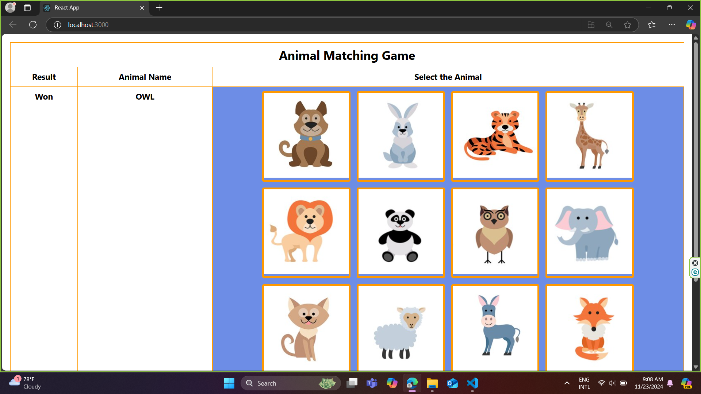

# 🛠️ React Parent-Child Communication Example

This project demonstrates **parent-child communication** in a React application. The parent component sends data to the child component via **props**, and the child communicates back to the parent using **callback functions**.

---

## 🌟 Features

- **Parent Component**: Sends messages to and receives responses from the child component.
- **Child Component**: Displays its content and communicates back with the parent.

---

## 📂 Project Structure

```
.
├── src
│   ├── App.css          # Styles for the App component
│   ├── App.js           # Parent component logic
│   ├── index.css        # Global project styles
│   ├── index.js         # Entry point of the application
│   ├── ChildComp.js     # Child component logic
└── public
    ├── index.html       # Static HTML template
    └── output.png       # Screenshot of the rendered project (replace with actual image)
```

---

## 🚀 Getting Started

### Prerequisites

- **[Node.js](https://nodejs.org/)** (Latest stable version recommended)
- npm (default package manager for Node.js) or yarn

### Installation Steps

1. **Clone the repository**  
   ```bash
   git clone https://github.com/your-username/react-parent-child-communication.git
   cd react-parent-child-communication
   ```

2. **Install dependencies**  
   ```bash
   npm install
   ```

3. **Run the application**  
   ```bash
   npm start
   ```

4. **View in browser**  
   Open [http://localhost:3000](http://localhost:3000) to see the app in action.

---

## 📖 Usage

1. The **parent component** displays an initial message.
2. The **child component** renders a button or input field that, when interacted with, sends a response back to the parent.
3. The parent dynamically updates its content based on the child’s response.

---

## 🎨 Screenshot

  
*(Replace `output.png` with your actual project screenshot.)*

---

## 🤝 Contributing

1. Fork the repository.
2. Create a new branch:  
   ```bash
   git checkout -b feature-name
   ```
3. Make your changes and commit them:  
   ```bash
   git commit -m "Your message describing the changes"
   ```
4. Push to your branch:  
   ```bash
   git push origin feature-name
   ```
5. Submit a pull request for review.

---

## 📜 License

This project is open-source and available under the **MIT License**.

---

## 📞 Support

If you encounter any issues or have questions, feel free to create an issue in the repository or contact me via [email](mailto:your-email@example.com).


